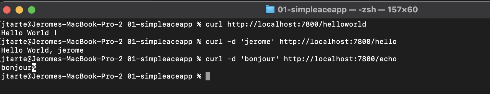
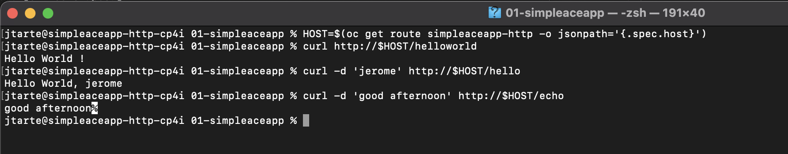

# Simple ACE application

This page is about a simple ACE demo app that could be deployd on OCP/CP4I cluster.

## The application

The demo application is a basic one. it contains 3 flows using java compute node. They could be trigger by doing a http request.

You could find in here :
* The [project interchange archive](./SimpleACEApp.zip) contains the source code of the project.
* The [Bar file](./SimpleACEApp.bar) of the ACE app. 

## Build the docker image 

The application is deployed using a custom ACE image. This image is build from an ACE base image plus the bar file of the application. Using this approach manual step to deploy the app on running ACE container. 

To build the docker image:
```
docker build -t jtarte/simpleaceapp:latest .
```

Once the image is built, don't forget to push the image that could be reached by your cluster. In my case, I use the Docker Hub


_optional: Run and test the container locally_

```
docker run --name simpleaceapp --rm -p 7800:7800 -p 7843:7843 -p 7600:7600 -e LICENSE=accept -d jtarte/simpleaceapp:latest
```

To test the application, you could use following command:
```
curl http://localhost:7800/helloworld
curl -d 'jerome' http://localhost:7800/hello
curl -d 'bonjour' http://localhost:7800/echo 
```


## Deploy the app on CP4I cluster

On an existing and configured OPC/CP4I cluster, to deploy the demo application, you could use the following command:

```
oc apply -f simpleaceapp-is.yaml
``` 

## Test the app on CP4I cluster 

```
HOST=$(oc get route simpleaceapp-http -o jsonpath='{.spec.host}')
curl http://$HOST/helloworld 
curl -d 'jerome' http://$HOST/hello 
curl -d 'good afternoon' http://$HOST/echo 
```


## Clean the env

Use the following command to remove the demo app
```
oc delete -f simpleaceapp-is.yaml
```
