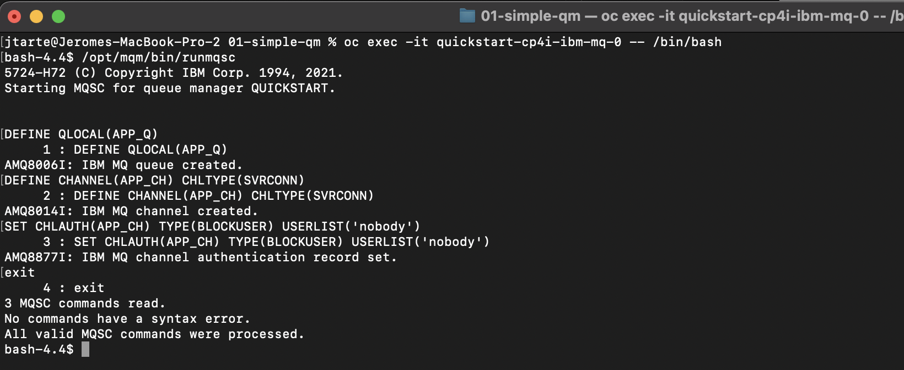

# Basic QM deployment (Quickstart)

This demo deploys a simple Queue Manager and uses MQ tools that are embeded into the container to interact with it:

* Create MQ config (queue, channel).
* send message. 
* retreive message. 


## Prerequisites

* CP4I installed 
* CP4I entitlement key configured on the OCP cluster (Cluster or namespace level)

## Steps

1. Deploy a queue manager using [the sample yaml file](./qm.yaml).
   ```
   oc apply -f qm.yaml
   ```
   
   Wait until the `queuemanager` instance get the `Running` state

2. Get the MQ console url.
   ``` 
   oc get queuemanager <queue manager name> -o jsonpath={.status.adminUiURl}
   ```
   

   With this URL, you could access to the MQ Console.
   
   

   The configuration of the Queue Manager could be done using this console. In the following steps, I use a different method. I use the MQSC commnad inside the container.

3. Get the name of the Queue Manager pod.
   ```
   oc get pods
   ```
4. Start a terminal session on the Queue Manager pod.
   ```
   oc exex -it <pod_name> -- /bin/bash
   ```
   

5. Launch the MQSC CLI
   ```
   /opt/mqm/bin/runmqsc
   ```
6. Define QM configuration with a local queue and and application channel.
   ```
   DEFINE QLOCAL(APP_Q) REPLACE
   DEFINE CHANNEL(APP_CH) CHLTYPE(SVRCONN) REPLACE
   SET CHLAUTH(APP_CH) TYPE(BLOCKUSER) USERLIST('nobody')
   ``` 
7. Exit the MQSC session but stay in the terminal session of the container.
   

8. Define the MQSERVER variable with channel name / TCP / hostname (service name of the queue manager) and the MQ port.
   ```
   export MQSERVER='<channel name>/TCP/<hostname>(1414)'`
   ``` 
9. Send a message to a queue on the queue manager.
   ``` 
   /opt/mqm/samp/bin/amqsputc <queue name> <Queue manager name>
   ```
10. Write several messages. You could end the application by clicking enter on an empty line.
    

11. Check the number of message avaible in the queue using the MQ console.
    

12. Retreive the messages with MQ tools. 
    ```
    /opt/mqm/samp/bin/amqsgetc <queue name> <Queue manager name>
    ``` 
     

13. Quit the Pod terminal session.

## Cleanup

You could cleanup your environment with the following command :
```
oc delete -f qm.yaml 
```