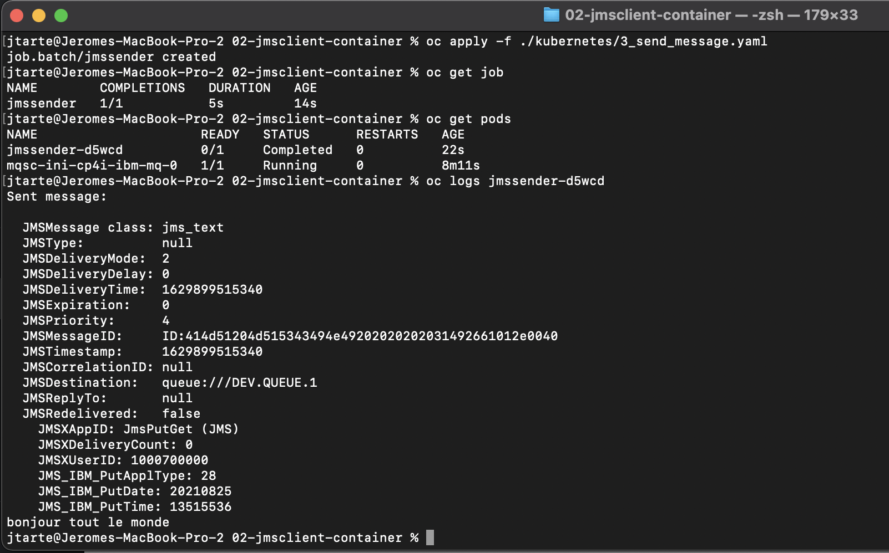

# JMS Client in container

This demo show a java-jms application, deployed as container on Openshift, close to the queue manager, interacting whit it (send and receive message).

# Prerequisites

* CP4I installed.
* CP4I entitlement key configured on the OCP cluster (Cluster or namespace level).
* `oc` CLI session active.

# Steps

## Build (optional)

You could use the Makefile to build the application. All the java part is managed by mvn

Clean the previous build
```
make clean
```
or 
```
mvn clean
```

Build executable jar 
```
make build
``` 
or 
```
mvn assembly:single 
```

Build the docker image (`jmsclient:latest`) 
```
make docker 
```

If needed you could push the image on a registry. The latest build is published on my docker hub repo : `jtarte/jmsclient:latest`.

The deployment yaml files, used later, refer this image, on docker hub.

## Deploy the MQ cluster

Apply for the MQ configuration and the queue manager.
```
oc apply -f ./kubernetes/1_mq_config.yaml,./kubernetes/2_mq_instance.yaml
```

Wait the Queue Manager is ready.
```
oc get queuemanager
```
The phase should be `Running`.

## Send a message

Apply the job that puts a message into the queue.
```
oc apply -f ./kubernetes/3_send_message.yaml
``` 
Check the job completion.
```
oc get job
``` 
Verify the log of the job
```
oc get pods 
oc logs <pod_id>
```



## Get the message

Apply the job that gets  message from the queue.
```
oc apply -f ./kubernetes/4_get_message.yaml
``` 
Check the job completion.
```
oc get job
``` 
Verify the log of the job
```
oc get pods 
oc logs <pod_id>
```

