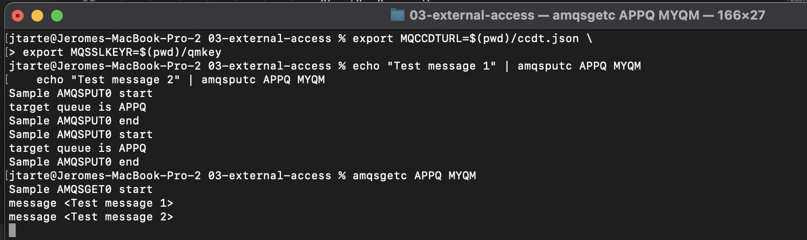

# External access to a CP4I hosted MQ instance

This demo shows how to configure the certifcate allowing an external access to MQ instance and how to use it. 

## Prerequesites

* CP4I installed.
* CP4I entitlement key configured on the OCP cluster (Cluster or namespace level).
* `oc` CLI session active.
* MQ client installed on the laptop and present in the `PATH` env variable.

## Steps

### Create certificate and key repo

1. Create the certificate that will be used by MQ instance. I use the name of the queue manager as CN in the certificate.
    ```
    openssl req -newkey rsa:2048 -nodes -keyout myqm.key -subj "/CN=myqm" -x509 -days 3650 -out myqm.crt
    ```
    It generates the certifcate, `myqm.crt`, and its assoicated file, `myqm.key`

    *Optional:* If you want to check the generate certiciate, you could use the following command:
    ```
    openssl x509 -text -noout -in myqm.crt
    ```

2. Create the key database used by the client.
   ```
   runmqakm -keydb -create -db qmkey.kdb -pw password -type cms -stash
   ```
   
    It generates 4 files:
    * `qmkey.kdb`. Key database.
    * `qmkey.crl`. Revocation list.
    * `qmkey.rdb`. Certificate requests.
    * `qmkey.sth`. Password stash. Used to pass the password ("password") in scripts instead of promting the user.

3. Add the Queue Manager certificate to the database.
    ```
    runmqakm -cert -add -db qmkey.kdb -label myqmcert -file myqm.crt -format ascii -stashed
    ```

    To check the content of th ekey databse, you could use the following commands:
    ```
    runmqakm -cert -list -db qmkey.kdb -stashed
    runmqakm -cert -details -db qmkey.kdb -stashed -label myqmcert
    ```

### Deploy the Queue Manager instance

1. Create a secret with MQ instance certificate. 
    ```
    oc create secret tls myqm-secret --cert="myqm.crt" --key="myqm.key" 
    ```

2. Load the MQ instance configuration into a config map.
   ```
   oc apply -f myqm-config.yaml
   ```

3. Create the MQ instance. 
   ```
   oc apply -f myqm-instance.yaml
   ```
    Wait Until the `queuemanager` reaches the `Running`phase
  

4. Create the required route.
    
    MQ Clients use Server Name Indication (SNI) to connect to queue managers on OpenShift. This requires a route with a host name in the form `<lowercase channel name>.chl.mq.ibm.com`.

    ```
    oc apply -f myqm-route.yaml
    ```

### Test the MQ instance

1. Get the hostname of the route created by MQ operator. 
    ```
    oc get route <route name> -o jsonpath={.spec.host}
    ``` 

2. Create a `ccdt.json` with the following content.
    ```
    {
        "channel":
        [
            {
                "name": "APPCHL",
                "clientConnection":
                {
                    "connection":
                    [
                        {
                            "host": "myqm-ibm-mq-qm-mq.cluster-roks-on-vpc-b327-f54dfdb602b48210069b59bca45066bc-0000.eu-de.containers.appdomain.cloud",
                            "port": 443
                        }
                    ],
                    "queueManager": "MYQM"
                },
                "transmissionSecurity":
                {
                    "cipherSpecification": "ECDHE_RSA_AES_128_CBC_SHA256"
                },
                "type": "clientConnection"
            }
        ]
    }
    ```
    The values in the file shoudl reflect your MQ instance configuration. The host is the one you retreived at step 1.  

3. Define needed env variables. `MQCCDTURL` points to the location (full path) of ccdt.json. `MQSSLKEYR` points to the key database location (full path), give by its name without the .kdb extension.
    ```
    export MQCCDTURL=$(pwd)/ccdt.json
    export MQSSLKEYR=$(pwd)/qmkey
    ```

4. Send messages to the queue.
    ```
    echo "Test message 1" | amqsputc APPQ MYQM
    echo "Test message 2" | amqsputc APPQ MYQM
    ```

5. Get messages from the queue.
    ```
    amqsgetc APPQ MYQM
    ```

The result should be similar to the following picture:


## Cleaning

Clean the env with the following commands:
```
oc delete -f myqm-route.yaml
oc delete -f myqm-instance.yaml
oc delete -f myqm-config.yaml
oc delete secret myqm-secret
```

