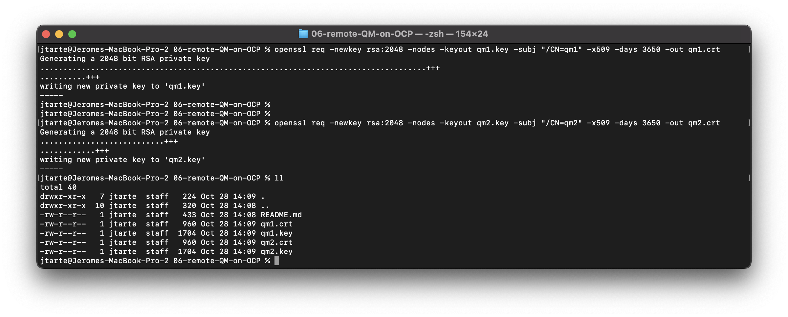
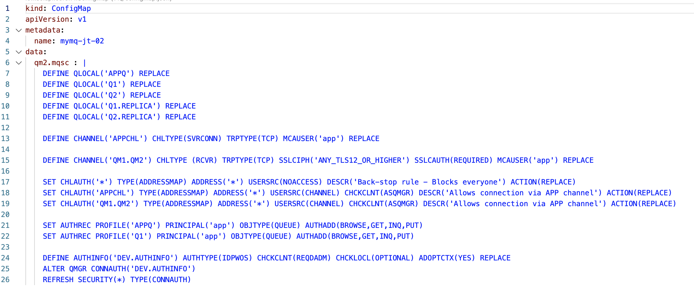
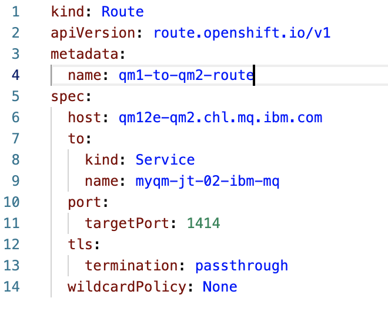
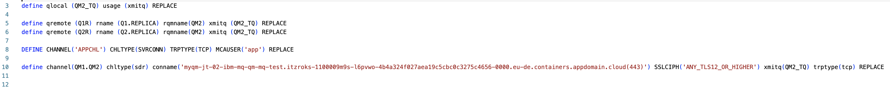
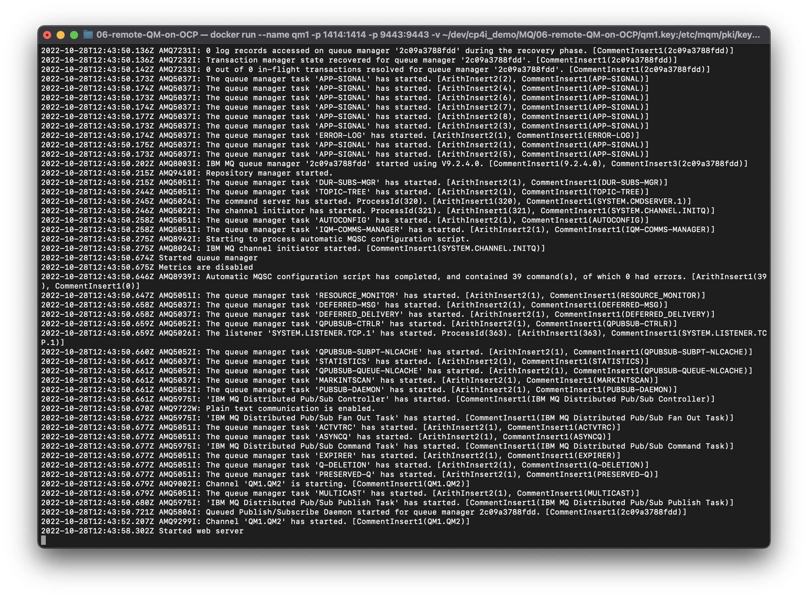
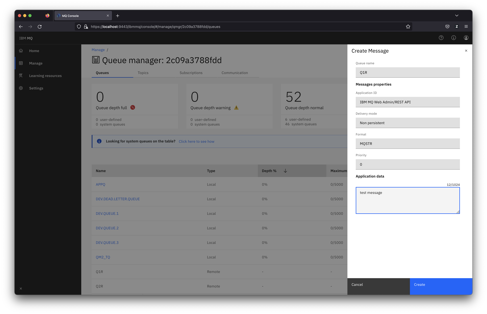
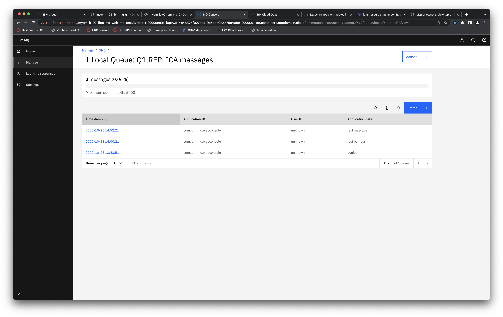

# Demonstrate the communication between Queue Managers

This demo shows how to enable the communication betwen two Queue Managers. A sender (on a container for the demo) and a reciever deployed on OpenShift. 

## Generate the certificates / keys

The first step is to create the certificates/keys that are used by the Queue Managers.

Create the certificate and key for the QM1
```
openssl req -newkey rsa:2048 -nodes -keyout qm1.key -subj "/CN=qm1" -x509 -days 3650 -out qm1.crt
```

Create the certificate and key for the QM2
```
openssl req -newkey rsa:2048 -nodes -keyout qm2.key -subj "/CN=qm2" -x509 -days 3650 -out qm2.crt
``` 



## Upload the certificates and keys on OpenShift

As the QM2 will run on OpenShift, the QM2 certificate and secret should be uploadded into a secret.
``` 
oc create secret tls qm2-secret --cert="qm2.crt" --key="qm2.key"
```

The certificate of QM1 should also be uploaded as it will be used to established the communication between the Queue Manager
```
oc create secret generic  qm1-secret --from-file=cert="qm1.crt"
```
Only the certificate of QM1 need to be provided to QM2.

## Create the queue manager on OpenShift

The file [qm2-mqsc.yaml](./qm2/qm2-mqsc.yaml) gives a sample config for the Queue Manager.

 

The important point here is th definition of the receiver channel
```
DEFINE CHANNEL('QM1.QM2') CHLTYPE (RCVR) TRPTYPE(TCP) SSLCIPH('ANY_TLS12_OR_HIGHER') SSLCAUTH(REQUIRED) MCAUSER('app') REPLACE
```

Deploy the ConfigMap on OpenSHift
```
oc apply -f ./qm2/qm2-mqsc.yaml
```

Create the QM2 instance using the provided file [qm2.yaml](./qm2/qm2.yaml)
```
oc apply -f ./qm2/qm2.yaml
```

## OutboundSNI : CHANNEL or HOSTNAME ?

On the client side (in our case, the sender), this parameter define if the encoded channel name will be sent during the establishment of the connection. 

By default the value is CHANNEL. So to allow the communication to be established, you define a route on the receiver side. 


```
oc apply -f ./qm2/qm1.qm2.channel.route.yaml
```
With this option, you have to configure the QM receiver to worker with channel name on the route.

But with latest MQ version, you have the possibility to configure the client to work with the hostname rather than the channel. If this case, you have to set up the `OutboundSNI` parameter to HOSTNAME.
To enable that, you have to set the parameter inside the ini file of the client (in our case, the qm1 Queue Manager).


in our exampel, as the qm1 is running as container, don't forget to provide the ini file at the startup. You may have to adjust the docker run command.  


## Create the QM1 Queue Manager

For the demo purpose, I'm using a MQ instance ruuning in a container.

The [qm1.mqsc](./qm1/qm1.mqsc) provide a sample configuation.
It defines remote queue, transit queue used by remote queues and a sender channel pointing to the remote QM (here QM2 deployed on OpenShift)



Launch the container using the configuration in [qm1.mqsc](./qm1/qm1.mqsc)
```
docker run --name qm1 -p 1414:1414 -p 9443:9443 -v $(pwd)/qm1.key:/etc/mqm/pki/keys/default/tls.key -v $(pwd)/qm1.crt:/etc/mqm/pki/keys/default/tls.crt -v $(pwd)/qm2.crt:/etc/mqm/pki/trust/0/tls.crt -v $(pwd)/qm1/qm1.mqsc:/etc/mqm/qm1.mqsc -e LICENSE=accept --rm ibmcom/mq
```




## Test the communication

Go on the web console of QM1 and create a message on Q1R (a remote queue).


If all was configured correctly, the communication between the two QueueManager is established. So the message is transfered to the remote QueueManager. You shoudl not see it on QM1. 

Go on the web console of QM2 and check the message on the target queue.
